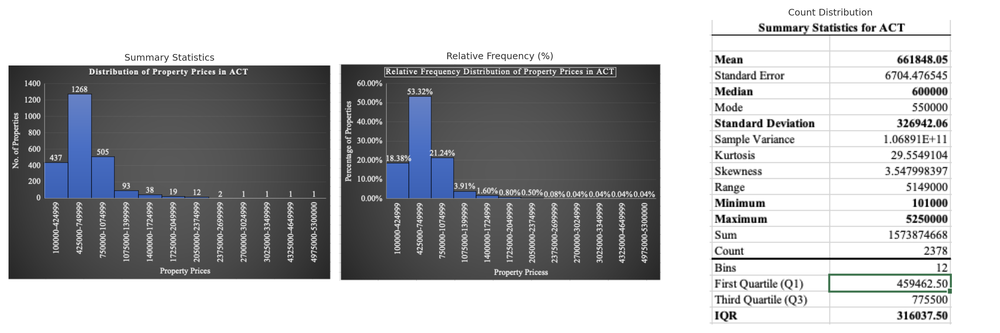
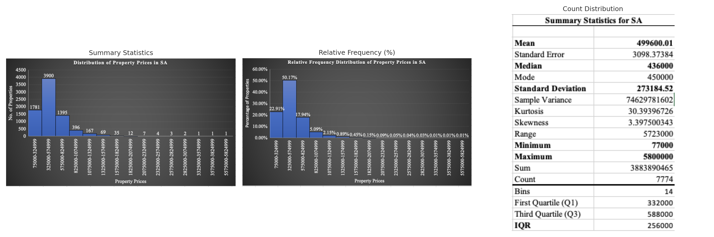
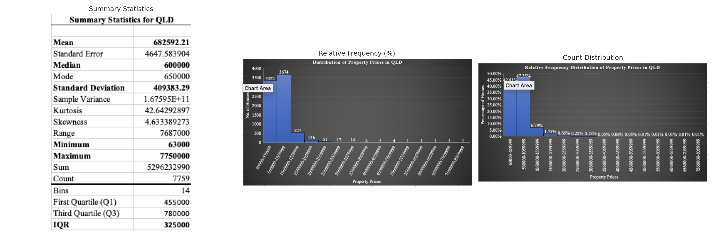

# 📊 Real Estate Price Analysis Across Australian States

  

---

## 📚 Table of Contents
- [🔧 Key Skills Used](#-key-skills-used)
- [📘 Overview](#-overview)
- [📂 Dataset Overview](#-dataset-overview)
- [📊 Visual Analysis](#-visual-analysis)
- [📐 Sample Proportion and Confidence Intervals](#-sample-proportion-and-confidence-intervals-townhouses)
- [💡 Insights & Impact](#-insights--impact)
- [✅ Next Steps](#-next-steps-if-extended)
- [🔗 Repository Info](#-repository-info)

---

## 🔧 Key Skills Used
- Excel Pivot Tables  
- Descriptive Statistical Analysis  
- Confidence Interval Estimation  
- Data Visualisation Techniques:  
  ▫ Histograms  
  ▫ Box Plots  
  ▫ Frequency Distribution Charts  
- Comparative Price Analytics  
- IQR & Outlier Detection

---

## 📘 Overview

This data analysis project investigates real estate property prices across **three Australian states/territories**:  
- **Australian Capital Territory (ACT)**  
- **South Australia (SA)**  
- **Queensland (QLD)**

The primary goal is to identify patterns in property price distributions, assess statistical differences between regions, detect outliers, and estimate the sample proportions of townhouse properties using inferential methods. Microsoft Excel was used for all data wrangling, analysis, and visualization.

---

## 📂 Dataset Overview - <a href="https://github.com/ramanavbezborah/Property-Market-Analysis/blob/main/assets/Australian%20Property%20Data%202019.xlsx" download>Download Excel Dataset</a>

| Metric                 | ACT            | SA             | QLD            |
|------------------------|----------------|----------------|----------------|
| Sample Size            | 2,378          | 7,774          | 7,759          |
| Mean Price             | $661,848       | $499,600       | $682,592       |
| Median Price           | $600,000       | $436,000       | $600,000       |
| Standard Deviation     | $326,942       | $273,184       | $409,383       |
| Min – Max Range        | $101k – $5.25M | $77k – $5.8M   | $63k – $7.75M  |
| IQR (Q3 – Q1)          | $316,037       | $256,000       | $325,000       |
| Skewness               | 3.55           | 3.40           | 4.63           |

---

## 📊 Visual Analysis

### 🔹 ACT

  

- Majority of properties priced between **$425k–$750k**
- Strong **positive skew** with long tail and high-priced outliers
- Median and mean diverge significantly due to skew

### 🔹 SA

  

- Most properties between **$325k–$575k**
- Also **right-skewed**, though slightly less extreme than QLD
- Lower variability, suggesting tighter pricing clusters

### 🔹 QLD

  

- Broadest price range with **most extreme outliers**
- Properties most commonly between **$60k–$1.05M**
- Most skewed distribution, heavily influenced by ultra-luxury listings

### 🔸 Box Plot Comparison

  

- ACT and SA have relatively tight distributions
- QLD has greater spread and the most extreme outliers
- All three distributions show **positive skewness** and presence of outliers

---

## 📐 Sample Proportion and Confidence Intervals (Townhouses)

| State | Sample Proportion | 95% Confidence Interval |
|-------|--------------------|--------------------------|
| ACT   | 12.57%             | 11.24% – 13.91%          |
| SA    | 3.68%              | 3.26% – 4.10%            |
| QLD   | 10.72%             | 10.03% – 11.41%          |

---

## 💡 Insights & Impact

1. **Policy Formulation**  
   Median and IQR are more suitable than mean due to skewed distributions. This matters for setting real estate taxes or subsidies.

2. **Urban Planning**  
   SA has the lowest townhouse proportion, suggesting more detached housing. This insight helps in zoning and infrastructure planning.

3. **Investor Decisions**  
   High variance and extreme outliers in QLD indicate **risk and reward** potential — ideal for high-stakes investors.

4. **Affordability Watch**  
   SA shows tighter clusters and more affordability compared to ACT or QLD — a sign of greater price control or market maturity.

---

## ✅ Next Steps (If Extended)
- Add time series trends if data includes dates  
- Explore correlation with property types, size, or location clusters  
- Implement predictive models using Python or Power BI  

---

## 🔗 Repository Info

This project was completed as part of a data analytics assignment at UniSA.  
Explore the code, visuals, and Excel workbook to dive deeper into the analysis.

⭐ **Star this repo** if you found it useful!  
📬 **Contact**: [Ramanav on GitHub](https://github.com/ramanavbezborah)
